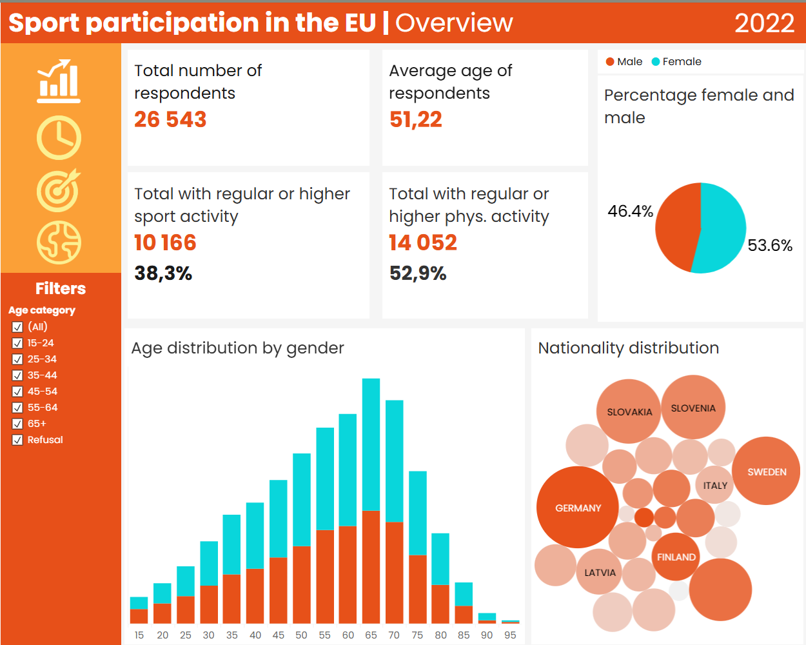
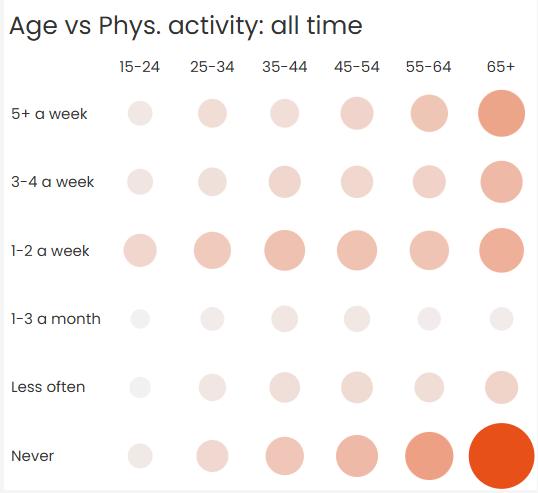
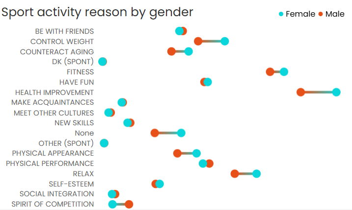
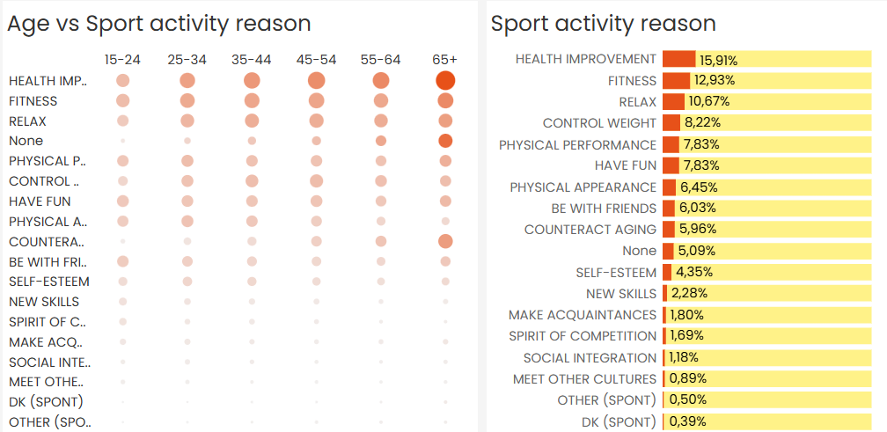
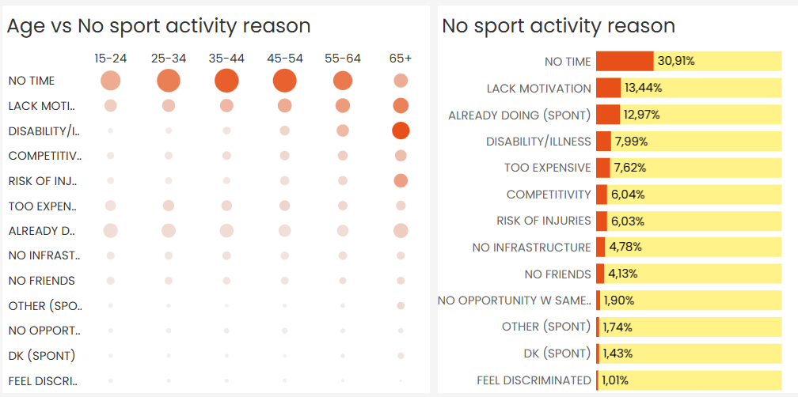
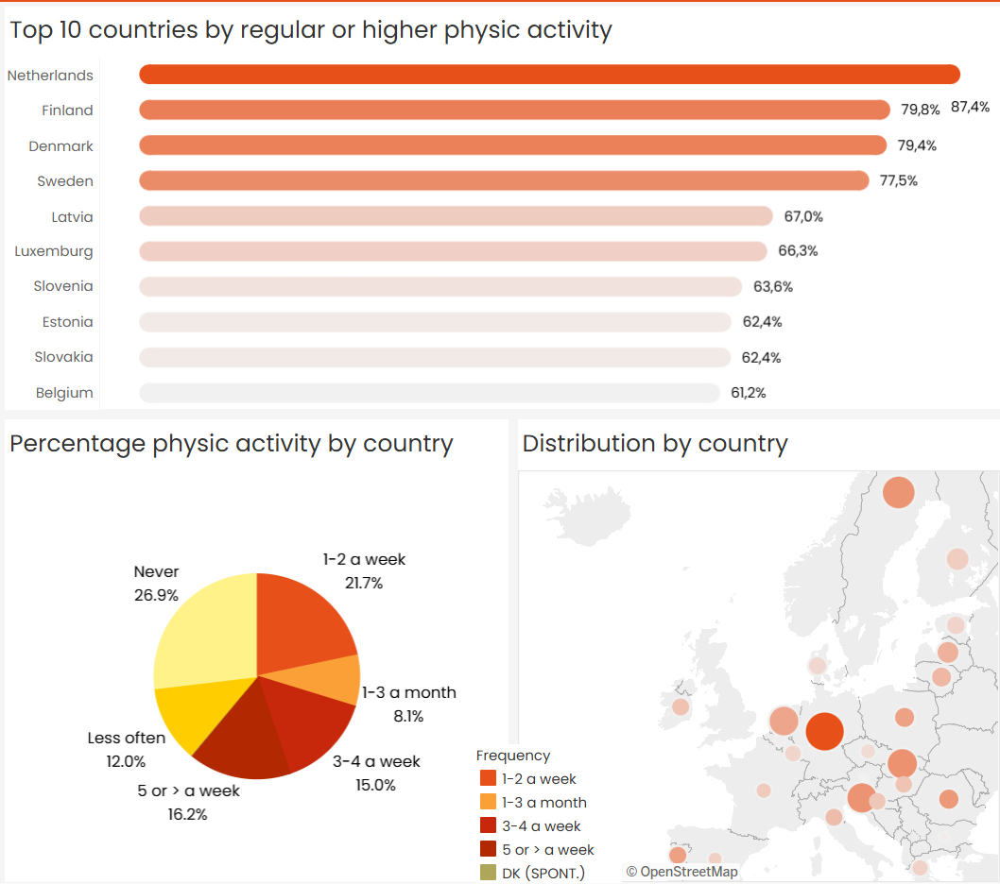

# **Sport Participation in the EU**: Demographic Trends and Personal Drivers

## Project Background
This project analyzes data from the Eurobarometer 97.3 (2022) survey to understand how different population groups across the European Union engage in sport and physical activity.

The core objective is to provide actionable insights for sports app developers and fitness-oriented businesses who seek to identify their optimal target audience and adapt their offerings to specific demographic segments and behavioral patterns.

This project leverages previously underexplored survey data on sport habits, motivations, and barriers to participation. By analyzing these aspects across age, gender, and country, the project uncovers high-potential market segments and behavioral drivers behind sport engagement.

Insights and recommendations are provided on the following key areas:

- **Sport and Physical Activity Frequency:** Identification of how often different groups engage in sport and non-sport physical activity (e.g., walking, cycling).

- **Motivations and Barriers:** Analysis of why people choose to be active—or not—including health, fitness, time, and psychological factors.

- **Demographic Profiles:** Comparisons across age groups, genders, and EU countries to find the most active populations.

- **Country-Level Opportunities:** Highlighting top-performing markets such as Finland and the Netherlands for business targeting.

An interactive Tableau dashboard is available [here](https://public.tableau.com/views/sportEU/Motivat?:language=en-US&:sid=&:redirect=auth&:display_count=n&:origin=viz_share_link).
Testing and analysis of all hypotheses in a text file [here](Testing%20hypotheses.pdf)

## Data Structure 
The dataset used in this project consists of 26,543 records and 124 columns, derived from the cleaned version of the Eurobarometer 97.3 (2022) survey. It contains individual-level responses from participants across EU countries regarding sport and physical activity behavior.

The structure includes:

- **Respondent metadata** (e.g., unique ID, country of residence)

- **Nationality indicators** (e.g., n_BELGIUM, n_GERMANY, ...): binary flags for each nationality

- **Activity frequency variables** (e.g., sport and physical activity frequency)

- **Motivations** for participating in sport

- **Barriers** for not participating

- **Demographic variables** such as age, gender, region, and weighting factor

Initial data checks were performed to:

- Verify column uniqueness and types

- Ensure demographic and activity variables are complete and interpretable

- Normalize binary indicators for nationality, motivations, and barriers

The cleaned dataset can be found [here](./data/sport_activity_data.csv).

## Executive Summary
### Overview of Findings
The analysis of sport and physical activity behavior across the European Union reveals strong demographic and regional patterns that are critical for market segmentation and product design in the fitness and sports tech industry.

Key participation insights include:

- Sport participation is highest in Finland (68.1%), Netherlands (59.4%), and Sweden (58.9%).

- Young adults (15–24) show significantly higher sport engagement (65.8%) compared to older adults (65+) (27.7%).

- Men report a slightly higher sport activity levels than women: 41.8% vs 35.3%.

- Top motivations include health improvement (15.9%) and fitness (12.9%), consistent across all age groups.

- Main barrier among working-age adults (25–54) is lack of time; older adults cite health limitations more frequently.

These findings indicate clear target audience opportunities and inform how sports applications can optimize features, tone, and positioning for different market segments.

Below is a snapshot from the interactive Tableau dashboard. More breakdowns and visual insights are available throughout this report. You can see the full dashboard [here](https://public.tableau.com/views/sportEU/Motivat?:language=en-US&:sid=&:redirect=auth&:display_count=n&:origin=viz_share_link).

### Age Trends:
- **Young adults aged 15–24 exhibit the highest levels of engagement** across all types of activity. According to the data, 62.15% of young respondents engage in physical activity either regularly or with some regularity. This compares to just 27.67% of older adults aged 65+, representing a 34.48% gap. The difference is especially sharp when considering those who engage with some regularity: 46.11% of youth versus only 19.81% of seniors.

- A similar pattern holds for sport-specific activity. A **total of 65.81% of respondents** aged 15–24 engage in sport, while only **27.67% of seniors** do — a difference of 38.14%. Although the gap in regular sport participation is narrower (11.24% among youth vs 7.86% among older adults), the contrast in occasional or some regularity engagement is particularly striking (54.57% vs 19.81%).

- These results suggest that younger people are significantly more receptive to sport and physical activity offerings, making them a natural primary audience for most digital fitness solutions. Meanwhile, older adults represent an underserved group, whose lower engagement levels may be linked to physical limitations, motivational barriers, or lack of tailored solutions. For this segment, sport products should prioritize accessibility, low-impact routines, and medical-wellness alignment.

### Gender Differences
- Across the dataset, **men report higher levels of participation in both sport and general physical activity**. Specifically, 41.8% of men report engaging in sport regularly or with some regularity, compared to 35.3% of women — a 6.5 percentage point difference. In terms of overall physical activity (including non-sport movements such as walking, cycling, etc.), men also lead by 4.8 percentage points, indicating a consistent trend of higher engagement across domains.

- While the gap is not extreme, it is statistically and behaviorally meaningful. It points to potential differences in lifestyle, motivations, or structural barriers between men and women. This reinforces the importance of inclusive app features and messaging. For example, sport apps may benefit from offering wellness- and lifestyle-oriented features that appeal more to women, such as holistic fitness tracking, community support, and low-impact routines. Meanwhile, men may be more responsive to performance-based metrics, competition, and training programs aimed at physical improvement.

- Despite the male advantage in participation rates, the top motivations remain consistent across genders — b**oth cite health improvement and fitness as the primary drivers**. However, deeper analysis shows that men are slightly more likely to cite physical performance, while women are more likely to engage for general wellness and fitness.

- These findings underscore the value of gender-informed segmentation. Developers and health product designers should move beyond neutral assumptions and begin addressing the unique motivators, preferences, and constraints faced by different gender groups to improve both adoption and retention.

### Motivational Drivers
- Across all demographic groups — regardless of age or gender — the primary reasons for engaging in sport are overwhelmingly **focused on health improvement and fitness maintenance**. In the aggregated results, 15.9% of respondents cite health as their main motivation, followed by 12.9% who cite fitness. These motivations surpass more social or emotional reasons such as fun, competition, or appearance.

- This consistent pattern suggests that sport is viewed by most individuals not primarily as a form of entertainment, but as a means of maintaining physical and mental well-being. For developers, this insight highlights the importance of emphasizing health outcomes, personal progress tracking, and wellness-oriented features in app design — especially if the goal is to reach a broad audience across the EU.

- When examining motivational differences by gender, men still prioritize health and fitness, but their choices show a slightly stronger association with physical performance goals. Messaging that emphasizes strength, endurance, and personal records may therefore resonate better with male users.

- In contrast, women are more likely to engage in sport with a general **focus on fitness** and well-being rather than competition or performance. This opens opportunities to position sport experiences as accessible, inclusive, and routine-oriented, potentially incorporating community support, holistic health features, or goal-based fitness journeys.

- Overall, the data makes it clear that sport is health-driven, not entertainment-driven — and aligning digital products with this mindset can yield stronger engagement and user relevance across regions and segments.

### Barriers to Participation
- Despite high levels of awareness about the benefits of physical activity, many individuals across the EU still do not participate in sport. The data reveals clear patterns in why people remain inactive, and these insights are critical for designing features that overcome resistance or friction in user behavior.

- The most commonly cited barrier overall is lack of time. This is especially true among working-age adults (25–54), where competing responsibilities such as work and family dominate daily schedules. Among this group, "lack of time" is by far the most frequent response, highlighting the importance of time-efficient solutions such as short-form workouts, adaptive schedules, and reminders. Sport products targeting this demographic must emphasize convenience, efficiency, and routine integration to reduce this friction.

- Among older adults (55+), lack of time remains the most common reason, but its share is noticeably lower than among younger respondents. Instead, health-related issues and age limitations rise in prevalence within this group. These barriers may be tied to chronic conditions, reduced mobility, or psychological perceptions of aging. Therefore, solutions for seniors should not only lower physical intensity, but also provide safe guidance, rehabilitation-friendly content, and clear medical alignment (e.g., doctor-approved programs).

- Understanding and addressing these specific obstacles is essential to increase sport participation and improve user retention across all age segments.

### Country-Level Participation
- In terms of overall physical participation — including sport and other forms of regular activity such as walking and cycling — **the Netherlands leads with 87.4%** of respondents reporting regular engagement. It is followed by Finland (79.8%) and Denmark (79.4%), positioning these countries as the most physically active populations in the EU. These environments are likely to be receptive to digital solutions that support already ingrained habits, such as step challenges, route tracking, and advanced fitness analytics.

- However, when looking specifically at sport participation, a different leader emerges. **Finland ranks first,** with 68.1% of respondents participating **in sport regularly** or with some regularity. The Netherlands (59.4%), Sweden (58.9%), and Denmark (58.8%) follow closely behind. This suggests that while the Netherlands excels in daily physical activity, Finland shows stronger engagement in structured sport behavior, such as team games, exercise programs, and competitive routines.

- These distinctions are important for product positioning. Countries with high general physical activity may favor lifestyle-integrated features (e.g., passive tracking, habit reinforcement), while countries with high sport engagement are better suited for performance-oriented apps, training plans, and community-based sport networks.

- Taken together, Finland and the Netherlands emerge as the top two countries for initial market entry — one leading in sport, the other in general activity. Both represent strong potential for adoption, particularly if products are localized and culturally attuned.

### Recommendations
1. **Prioritize Young and Working-Age Adults (15–54)**
Younger respondents (15–34) and working-age groups (35–54) show the highest levels of sport and physical activity engagement. These segments are already active and health-aware, making them ideal targets for feature-rich experiences, habit-building programs, and progress tracking tools. Products for these users should emphasize results, personalization, and continuity, helping them stay consistent and improve over time.

2. **Build for Time Efficiency**
Across nearly all age groups — but especially among working adults — lack of time is the #1 barrier to sport participation. Apps should offer quick-start options, short workouts (10–20 minutes), and smart scheduling or calendar integrations. Features that remove friction from the decision to be active (e.g., one-tap “Start Now” routines or weekly time budgets) will increase adherence and usability.

3. **Separate training programmes for different genders**
Gender differences in activity patterns and motivations are subtle but important. Men respond better to features emphasizing performance, progress, and training structure (e.g., goal tracking, strength metrics, achievements). Women show higher engagement when the focus is on fitness, well-being, and routine-friendly formats. Messaging that promotes balance, confidence, and long-term health tends to resonate more. Apps that include gender-aware personalization — without being stereotypical — are likely to see stronger adoption and satisfaction.

4. **Don’t Overlook Older Adults (55+)**
While participation rates drop significantly in older age groups, this segment remains underserved. The barriers they face — such as health concerns or age-related limitations — call for gentle, accessible, and safe activity formats. Design recommendations include:
- Low-impact movement routines (e.g., guided walking, chair yoga, stretching)

- Rehabilitative or doctor-approved content

- Motivation and community-based encouragement

- This demographic is growing and often under-targeted — building trust and usability here can yield long-term value.

5. **Target High-Engagement Countries First**
From a geographic standpoint, Finland and the Netherlands stand out as the most attractive markets for sports and fitness apps, based on their top rankings in both sport and overall physical activity. Localized features, cultural adaptation, and language options for these countries can significantly boost relevance and conversion. Sweden, Denmark, and Germany also present strong opportunities.